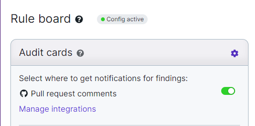

# Not receiving PR/MR comments

If you are not receiving PR comments or MR comments this usually means that there are permissions that you or your team have not approved. Otherwise this means that you have not selected PR comment integrations within the Rule Board.

This can be found under <mark style="color:purple;"></mark> <mark style="color:purple;"></mark><mark style="color:purple;">**App > Dashboard > Rule Board**</mark>.&#x20;

Within the settings of either the <mark style="color:purple;">**Audit cards**</mark> or the <mark style="color:purple;">**Blocker cards**</mark>**,** is a setting to integrate PR comments. Make sure this is set on to receive PR comments.

