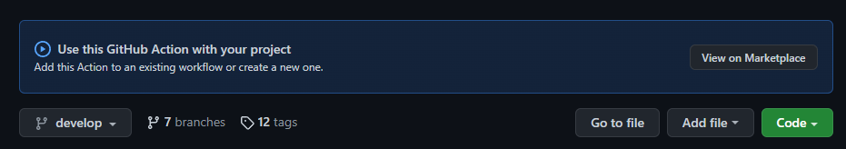
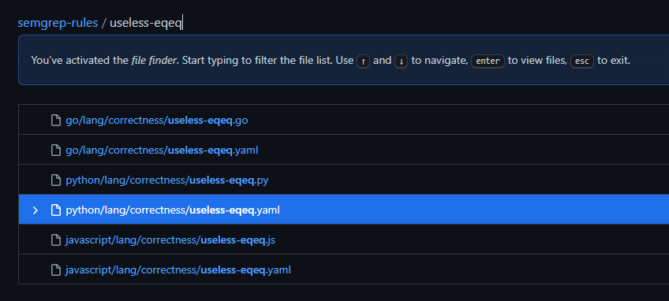
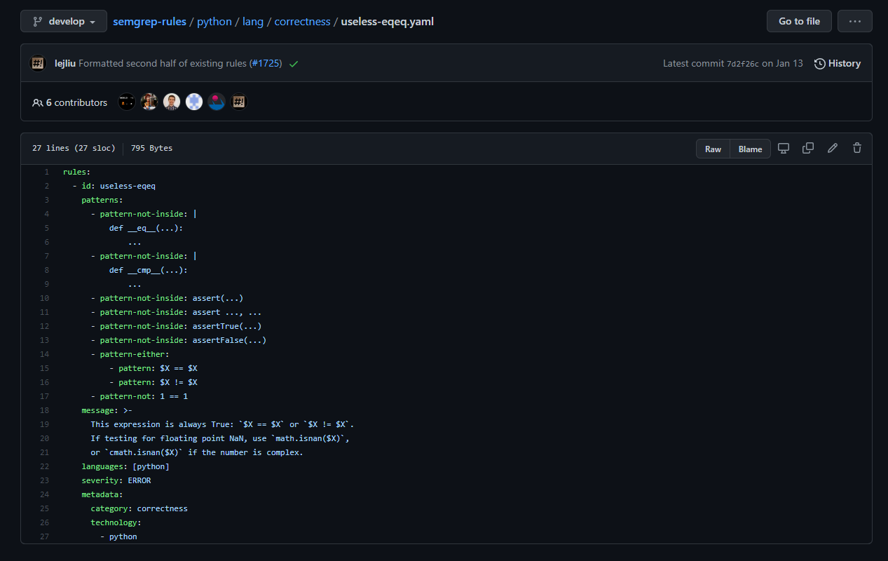

# Download a rule yaml file directly

To download a rule yaml file directly, go to the [<mark style="color:purple;">**Semgrep Rules Github Repository**</mark>](https://github.com/returntocorp/semgrep-rules).



Search for the rule-id using the "<mark style="color:purple;">**Go to file**</mark>" button within the rep

Once you have located the rule you wish to download, right-click on the "<mark style="color:purple;">**Raw**</mark>" button and then click "<mark style="color:purple;">**Save link as...**</mark>" to download the yaml file directly.

