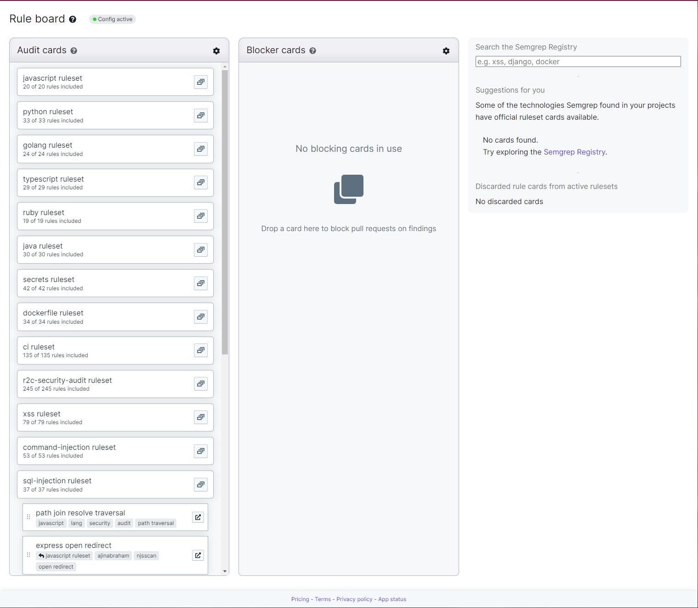
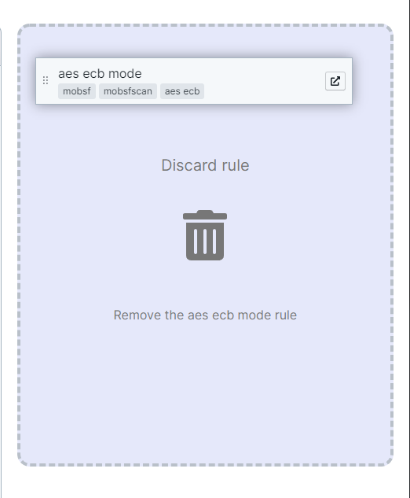
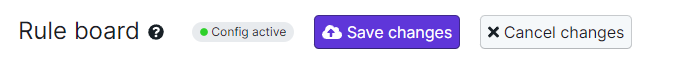

# Eliminating specific rules from scanning a repository

Currently, the best way of doing this is through the Semgrep app and subsequently the [<mark style="color:purple;">**Rule**</mark>](https://semgrep.dev/docs/semgrep-app/rule-board/)<mark style="color:purple;"></mark>[ <mark style="color:purple;">**board**</mark>](https://semgrep.dev/docs/semgrep-app/rule-board/).&#x20;



To get to the Rule board, head to <mark style="color:purple;">**App > Dashboard > Rule board**</mark>.&#x20;

To delete a rule, find the rule you wish to delete and drag it to the "Discard rule" area located in the top-right of the Rule board.

Do not forget to save once making any change to your Rule board or if the deletion was a mistake, cancel the changes.

If it is no longer seen within the Rule board, the deletion was complete! Happy scanning!
