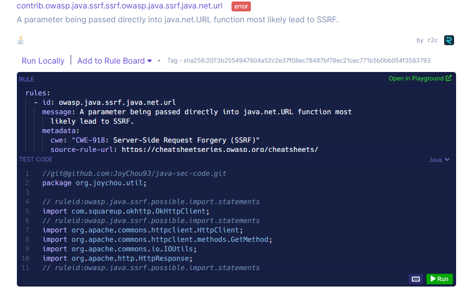
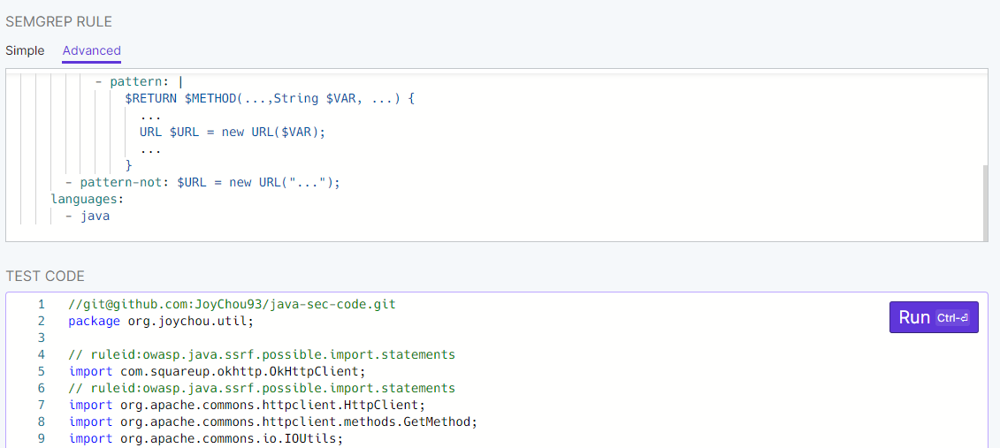

# Scanning a code snippet for just one rule

The best way to scan a code snippet for one rule is first heading over to the Semgrep [<mark style="color:purple;">**Rule Registry**</mark>](https://semgrep.dev/r) and finding the rule you wish to scan with.


Semgrep Rule Registry


Then, open up the rule and click on the `Open in Playground` button on the top-right of the rule info.

Finally, add your code snippet into the `Test Code` section of the Playground and run your scan!

