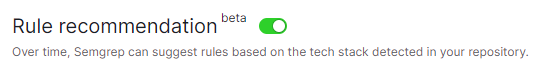

# '--config auto' but inside of the Semgrep App

Inside of the Semgrep App before creating a Project or after, you can turn on the **"**<mark style="color:purple;">**Rule recommendation**</mark>**"** feature to have Semgrep suggest rules over time based on the tech stack detected in your repository.

The way to find the "Rule recommendation" feature is through the following from the Semgrep App Dashboard:

`Dashboard > Projects > "Any project"`

