# Integrating Semgrep with Webhooks

Semgrep App contains four third-party integrations to allow you to add data from Semgrep to other tools that are part of your workflow. The first two are free to all users: Slack and Email; the last two: Jira, and Webhook, are for Team or Enterprise users only. Most people are have used or heard of the first three tools before. However, Webhooks tend to be more obscure. However obscure they may be, webhooks can provide a powerful way to use Semgrep. User who chooses to interact with Semgrep webhooks can create microservices or applications around the Semgrep App. In this article, I give a quick recipe to make a webhook listener that ingests Semgrep HTTP POST notifications and sends security scans and findings to Amazon SNS.  This article can serve as a standalone reference if you want to know how to create a webhook listener and send messages to SNS or be a template for more robust solutions for your application's needs.&#x20;

### Steps for Execution

1. <mark style="color:purple;"></mark>[<mark style="color:purple;">Create SNS Topic and Subscription</mark>](integrating-semgrep-with-webhooks.md#h\_01fswr4166khd7cbdzyx4r6x59)<mark style="color:purple;"></mark>
2. <mark style="color:purple;"></mark>[<mark style="color:purple;">Create Lambda Function</mark>](integrating-semgrep-with-webhooks.md#h\_01fswr7ddppk7hynv2s0xrz989)<mark style="color:purple;"></mark>
3. <mark style="color:purple;"></mark>[<mark style="color:purple;">Build API</mark>](integrating-semgrep-with-webhooks.md#h\_01fswr7491a4bcvt7rjw6jtnj2)<mark style="color:purple;"></mark>
4. <mark style="color:purple;"></mark>[<mark style="color:purple;">Deploy API</mark>](integrating-semgrep-with-webhooks.md#h\_01fswr6kn5khs8q6hwcs6jc9v5)<mark style="color:purple;"></mark>
5. [<mark style="color:purple;">Integrate with Semgrep Webhook</mark> ](integrating-semgrep-with-webhooks.md#h\_01fswr4g3s44z1kjz2sza23jjg)<mark style="color:purple;"></mark>

***

### Create a SNS Topic <a href="#h_01fswr4166khd7cbdzyx4r6x59" id="h_01fswr4166khd7cbdzyx4r6x59"></a>

First, we need to create an SNS Topic, an access point that acts as a communication channel. You can group multiple resources or services (i.e., Lambda, email, Amazon SQS) in one topic. And within this Topic, you can create Subscribers (AWS resources that either produce or consumes communication).&#x20;

First, navigate to Amazon SNS (you can do this by typing 'SNS' in the search bar on the AWS console page), and select <mark style="color:purple;">**Create topic**</mark>. On the Create topic page, select <mark style="color:purple;">**Standard**</mark> <mark style="color:purple;"></mark><mark style="color:purple;"></mark> for <mark style="color:purple;">**Type**</mark> <mark style="color:purple;"></mark><mark style="color:purple;"></mark> and name your Topic.

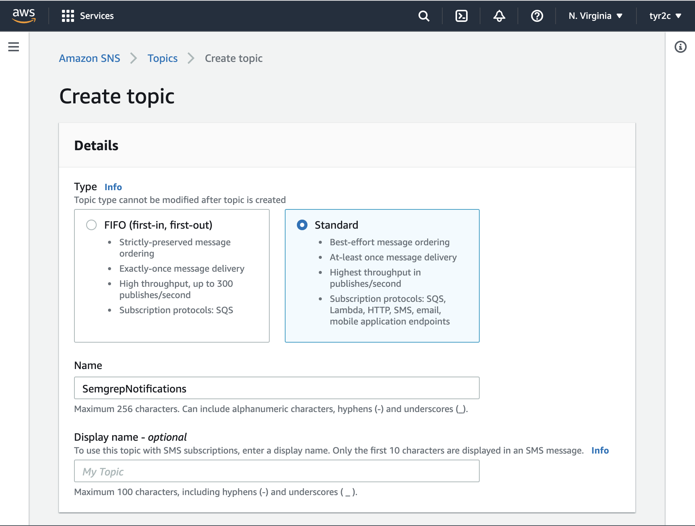

Scroll down and hit the <mark style="color:purple;">**Create topic**</mark> button.

### Create a Subscription

You should now have an SNS Topic. As said earlier, topics need to have subscribers (an AWS resource or service that produces or consumes messages); once you've created your Topic, you should be placed on your SNS topic dashboard. Hit the <mark style="color:purple;">**Create subscription**</mark> button.

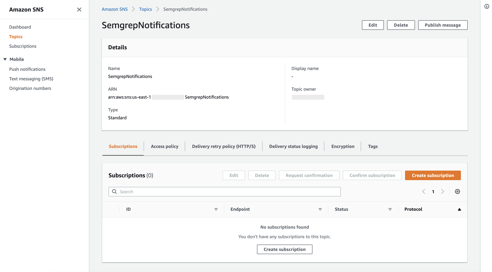

Once you are on the Create subscription page, you will select a <mark style="color:purple;">**Protocol**</mark> (The type of endpoint to subscribe to your SNS Topic). This is where you can choose how you would like to handle Semgrep notifications and findings. By using Semgrep webhooks, you can create the necessary business logic to fit your needs; you could possibly ingest Semgrep webhooks and build a microservice to handle security vulnerabilities that align more with your goals. For the simple example, I select Email-JSON as my Protocol.&#x20;

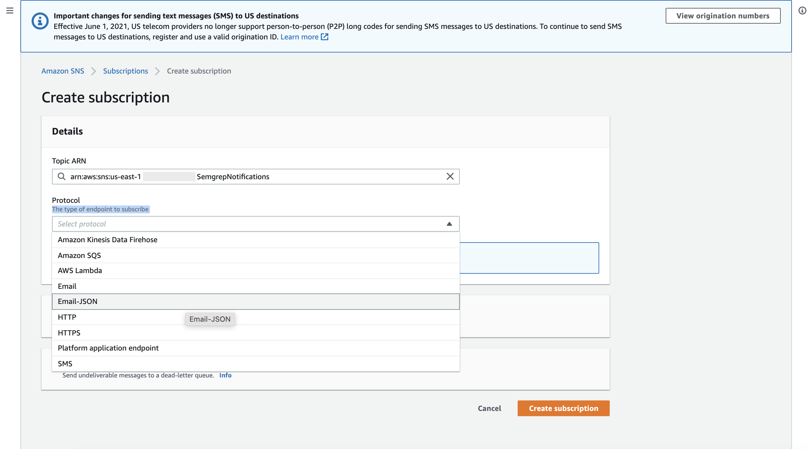

After selecting your protocol, add an Endpoint to send the notification and click the <mark style="color:purple;"></mark> <mark style="color:purple;"></mark><mark style="color:purple;">**Create subscription**</mark> button. In this example, I enter my email address.

### Create Lambda Function <a href="#h_01fswr7ddppk7hynv2s0xrz989" id="h_01fswr7ddppk7hynv2s0xrz989"></a>

Next, we need to create an AWS Lambda function that ingests Semgrep notifications via POST request and sends that notification to AWS SNS.&#x20;

First, navigate to your AWS management console, type Lambda into the search bar, and Click <mark style="color:purple;">**Lambda**</mark>. Once you are on the <mark style="color:purple;">**AWS Lambda**</mark> page, hit the **Create function** button. Under <mark style="color:purple;">**Create function**</mark>**,** Select <mark style="color:purple;">**Author from scratch**</mark>. Add a function name and a runtime for the function. In this example, I use <mark style="color:purple;"></mark> <mark style="color:purple;"></mark><mark style="color:purple;">**Python 3.8**</mark>** ** as my runtime. Under permissions, select the <mark style="color:purple;">**Create a new role with basic Lambda permissions**</mark>**.**

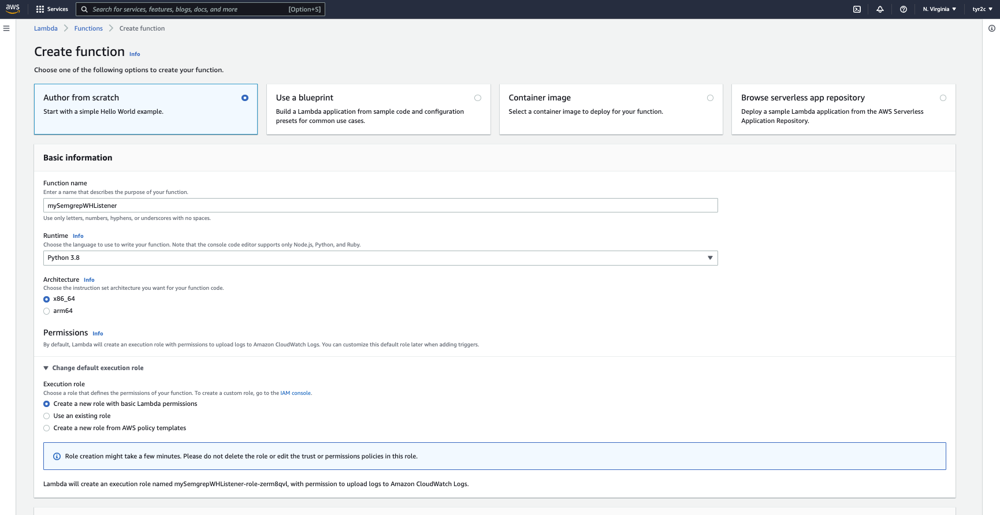

Once the Lambda function is created, you will be greeted with an inline text editor; here is where you can write the business logic of your function. In this example, we want to receive Semgrep scans and findings notifications and send them to SNS. The code below will do just that; you may also use it as a starting point for a more robust application:

```python
import json
import boto3


sns = boto3.client('sns')
arn = 'INSERT SNS ARN HERE'

# Post to sns.
def lambda_handler(event, context):
    message = ''    
    if type(event) == dict:
           message = event["semgrep_scan"]       
           response = sns.publish(
                      TopicArn=arn,           
                      Message=json.dumps(message)
           ) 
    elif type(event) == list:
          message = event[0]      
          response = sns.publish(
                    TopicArn=arn,          
                    Message=json.dumps(message)      
          ) 


    return message
```

```
If you prefer not to use the inline editor, 
you can upload your code from a file instead.
```

Before you are ready to deploy and send messages to SNS, click on the <mark style="color:purple;">**Configuration**</mark> <mark style="color:purple;"></mark><mark style="color:purple;"></mark> tab, and under <mark style="color:purple;">**Execution role**</mark>**,** click the Role's name**.** This should take you to the rule's Summary page.

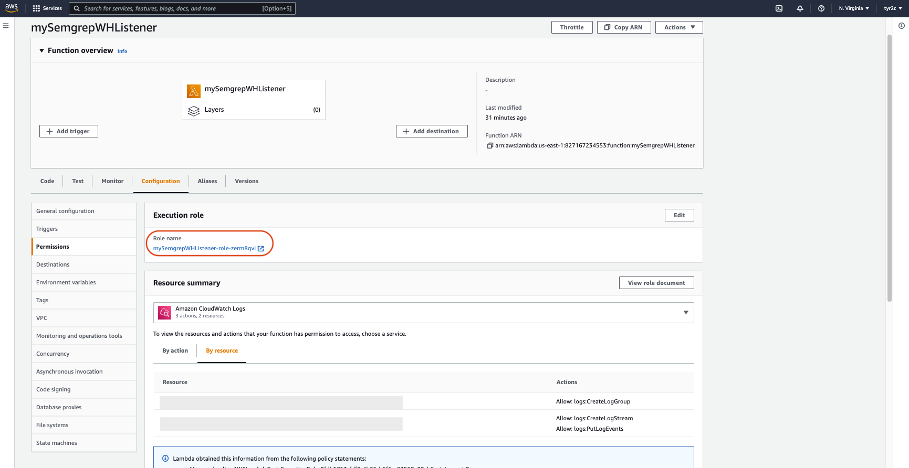

Click the <mark style="color:purple;">**Attach policies**</mark> button, and add the following policies:

* AmazonSNSRole
* AmazonSNSFullAccess

Once you are done, click the <mark style="color:purple;">**Code**</mark> tab to go back to the Lambda code and click **Deploy**.

### Build API  <a href="#h_01fswr7491a4bcvt7rjw6jtnj2" id="h_01fswr7491a4bcvt7rjw6jtnj2"></a>

For your Lambda to be accessible publicly through an HTTP POST, you need to create and deploy a REST API using your function as the backend.&#x20;

In the AWS Management Console, navigate to API Gateway (you can do this by searching for API Gateway in the search bar). Once in the API Gateway dashboard, click the <mark style="color:purple;">**Create API**</mark> button and select <mark style="color:purple;">**Rest API**</mark> as your API type (be sure not to select the private Rest API).&#x20;

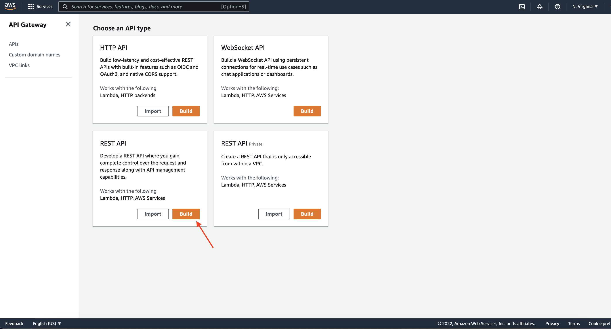

In the <mark style="color:purple;">**Choose the protocol**</mark> page, select REST and <mark style="color:purple;">**New API**</mark>. Lastly, give your API a name and description (optional), and choose <mark style="color:purple;">**Regional**</mark> <mark style="color:purple;"></mark><mark style="color:purple;"></mark> as your endpoint. Click the <mark style="color:purple;">**Create API**</mark> button.

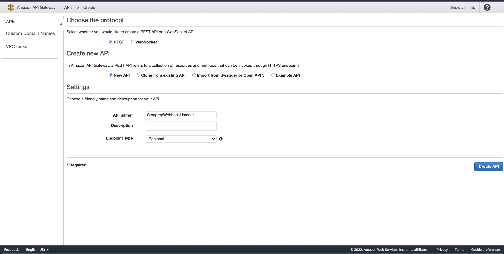

Once your API is created, you will be greeted by your API Dashboard; this is where you will be able to create custom endpoints, receive and handle requests, and fine-tune throttling to help protect your API from being overwhelmed by too many requests and produce better throughput.&#x20;

In the dashboard, click Actions in the Resource column, and select <mark style="color:purple;">**Create Method**</mark>. We want to create a method that handles POST requests (which is what Semgrep webhooks sends). From the dropdown, Select <mark style="color:purple;">**POST**</mark> <mark style="color:purple;"></mark><mark style="color:purple;"></mark> and click on the checkmark.

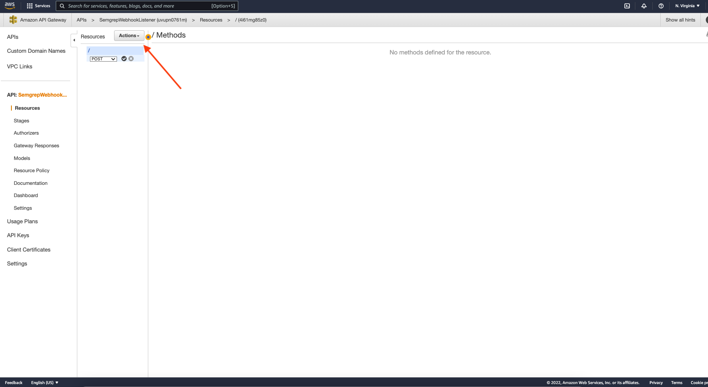

Once you are on the <mark style="color:purple;">**POST setup**</mark> page, select <mark style="color:purple;">**Lambda Function**</mark> as your Integration type, select the Lambda's region, input the Lambda function you want to point to, and click the <mark style="color:purple;">**Save**</mark> <mark style="color:purple;"></mark><mark style="color:purple;"></mark> button. You’ll get a notification that asks you to confirm that this API will be granted permission to invoke your Lambda function.

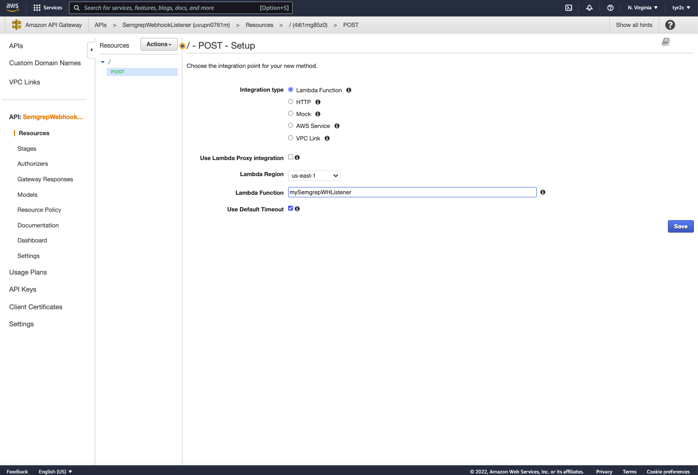

### Deploy API <a href="#h_01fswr6kn5khs8q6hwcs6jc9v5" id="h_01fswr6kn5khs8q6hwcs6jc9v5"></a>

Now that you have your POST method set up, it's time to make your API ready to use; you need to deploy your API. From the <mark style="color:purple;">**Actions**</mark> <mark style="color:purple;"></mark><mark style="color:purple;"></mark> dropdown menu, select <mark style="color:purple;">**Deploy API**</mark>. You will be prompted to enter a deployment stage and description; feel free to name your deployment stage whatever you like and add a description of the deployment; hit <mark style="color:purple;">**Deploy**</mark>.

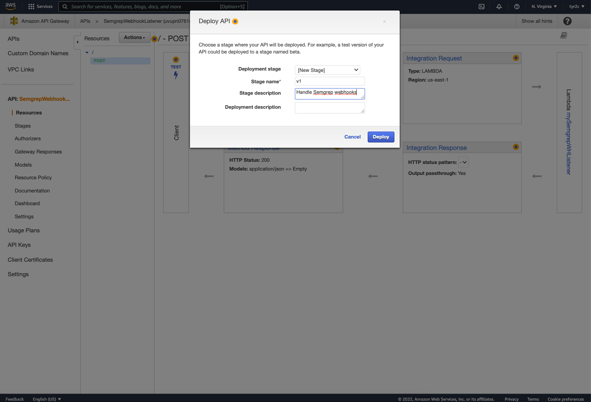

Once deployed, you will be taken to your <mark style="color:purple;">**Stage Editor**</mark> page; this is where you enable throttling; you can keep the default settings and click <mark style="color:purple;">**Save Changes**</mark>. Navigate to stages, and you should have a URL! This is the URL you will use to receive Semgrep Webhooks!

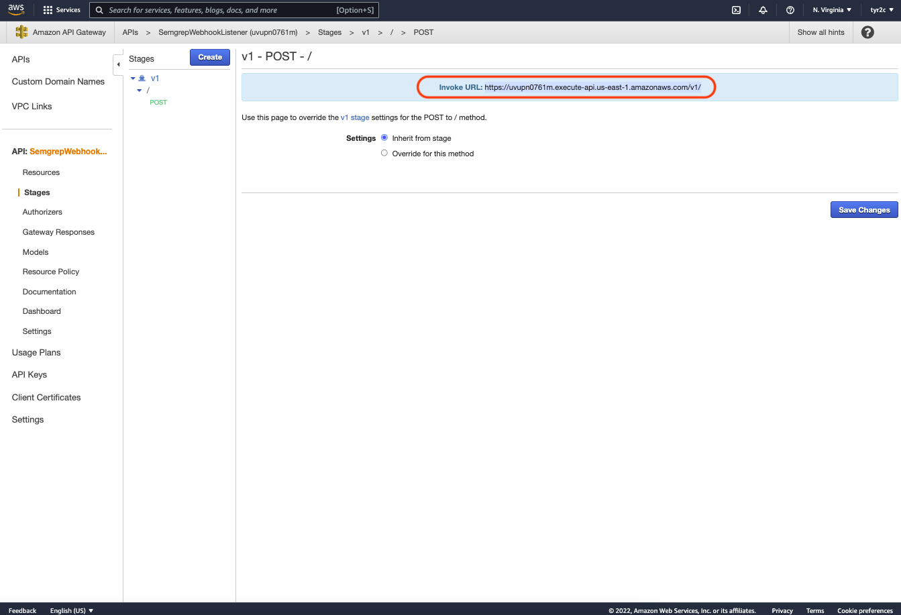

### Integrate with Semgrep <a href="#h_01fswr4g3s44z1kjz2sza23jjg" id="h_01fswr4g3s44z1kjz2sza23jjg"></a>

Now it is time to integrate your REST API with Semgrep! Login to your [<mark style="color:purple;">Semgrep App</mark>](https://semgrep.dev/products/semgrep-app) and click **Settings** on the left-hand panel. Click on the <mark style="color:purple;">**Integrations**</mark> <mark style="color:purple;"></mark><mark style="color:purple;"></mark> tab, and you should be given a choice to create an Integration Channel, select <mark style="color:purple;">**Webhook**</mark>.

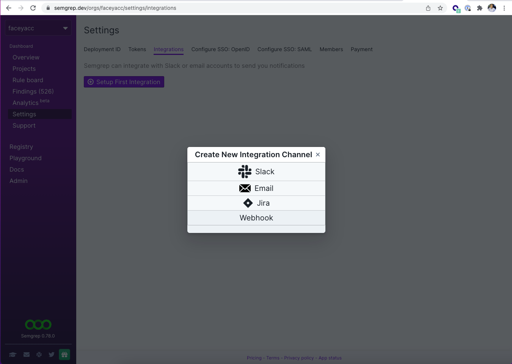

Give your Integration Channel a name and the URL you created earlier in the API Gateway, and click the **Test** button to see if Semgrep can talk to your endpoint. If the test was successful, you should see two green toast notifications on the upper right-hand side of the Semgrep App page.&#x20;

Now that your webhook listener is set up and connected to the Semgrep App to have Smegrep send notifications to your Integration Channel, navigate to the <mark style="color:purple;">**Rule board**</mark>** ** tab on the left-hand side of the Semgrep App. Click the small gear and toggle your Integration Channel.&#x20;

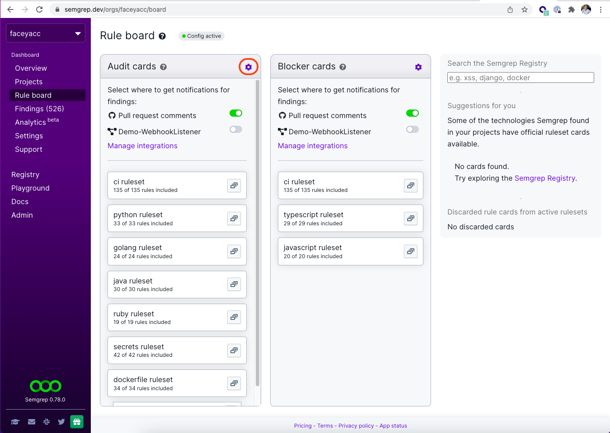

That it! You now have a webhook Listener that can ingest Semgrep webhooks. This integration will create a more personalized experience when working with Semgrep. Enjoy!🥳 🥳 🥳

&#x20;                                                                               r2c
